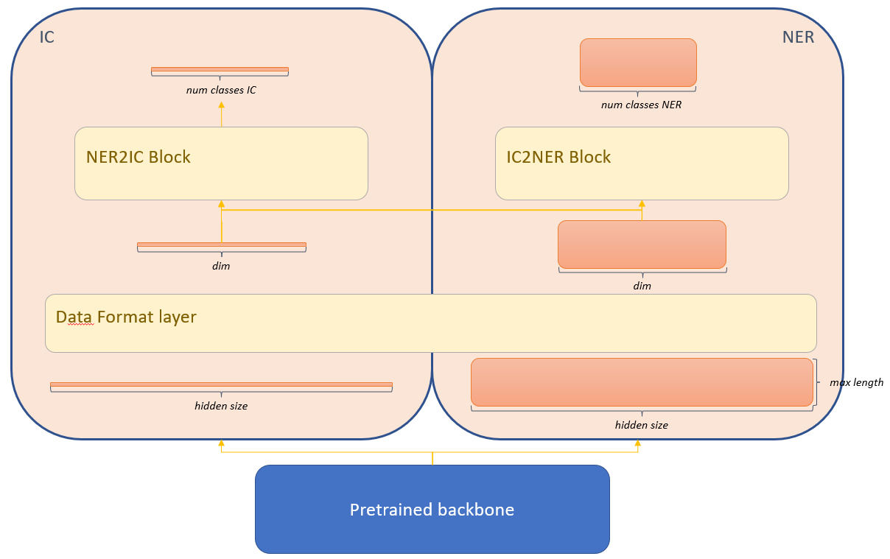

# MultiTask NLU

---
## Table of contents
- [1. Introduction](#introduction)
- [2. Repo structure](#repo-structure)
- [3. MultiTask implementation features](#multitask-implementation-features)
- [4. Monitoring integration](#monitoring-integration)
- [5. Streamlit app deployment](#streamlit-app-deployment)
- [6. Quickstart code](#quickstart-code)
- [7. License](#license)
---

## Introduction
Text and token classification are two of the most popular downstream tasks in Natural Language Processing (NLP), enabling semantical and lexical analysis of utterances, respectively. Both problems are intrinsecally linked, even though there has always been some disparity between them, therefore it makes sense to ask ourselves if there is any procedure to combine them in a network to help one task solve the other, and *vice versa*. That work was carried out in [this paper](https://www.researchgate.net/publication/355862206_Unified_Transformer_Multi-Task_Learning_for_Intent_Classification_With_Entity_Recognition), and in that model we will inspire our work.

We will make use of the recently released [MASSIVE dataset](https://github.com/alexa/massive):

> MASSIVE is a parallel dataset of > 1M utterances across 51 languages with annotations for the Natural Language Understanding tasks of intent prediction and slot annotation. Utterances span 60 intents and include 55 slot types. MASSIVE was created by localizing the SLURP dataset, composed of general Intelligent Voice Assistant single-shot interactions.

Information about intent and entities within utterances is contained in the dataset. The purpose of this repository is to find a place where, by simply modifying the `setup_data` method, you can get up to speed with your text-token classification downstream tasks, being able to compare the performance of the MulltiTask solution to the baseline isolated ones.

## Repo structure
The repository contains four components: `NLU_streamlit_app`, `IC`, `IC_KD`, `MultiTask` and `NER`. The first one is prepared to run a pretrained model checkpoint in a dockerised Streamlit app. Each of the remaining contains a structure like the following one:

Click here to find out!

    ├── src                                         # Compiled files (alternatively `dist`)
    │   ├── dataset.py                              # Method that structures and transforms data
    │   ├── loss.py                                 # Custom function to meet our needs during training
    │   ├── model.py                                # Core script containing the architecture of the model
    │   └── ...         
    ├── input                                       # Configuration files, datasets,...
    │   ├── info.json                               # Configuration file for datasets information
    │   ├── training_config.json                    # Configuration file for model architecture & training (batch_size, learning_rate,...)
    │   └── wandb_config.json                       # Credentiales for Weights and Biases API usage
    ├── main.py                                     # Main script to run the code of the component
    └── requirements.txt                            # Docker code to build an image encapsulating the code

## MultiTask implementation features

As it has already been mentioned, the architecture we use combines both text and token classification from a single feature extractor. To that end, we have to provide utterance intent and entity labelling. Some of the most remarkable components are:

* Text tokenisation and entity labels are included in dataset collator for memory efficiency purposes.
* Initial unification of hidden size to enable individualised processing of each problem.
* Relational modules to combine IC and NER information in both directions.
* Use of categorical crossentropy loss function for the IC branch, and focal loss function with $\gamma=2$ for the NER one. Final loss function is the average of both losses. Label smoothing for the first loss component, and gamma  parameter for the second, can be customised in the `training_config.json` file.
* Simple linear decay learning rate scheduler with warm start.

A visual description of the implementation is shown now:

You can also make use of the `IC` and `NER` components to compare with *baseline* models, solving those tasks separatedly.

## Monitoring integration
This experiment has been integrated with Weights and Biases to track all metrics, hyperparameters, callbacks and GPU performance. You only need to adapt the parameters in the `wandb_config.json` configuration file to keep track of the model training and evaluation. An example is shown [here](https://wandb.ai/azm630/MultiTask_NLU).

## Streamlit app deployment
The application we introduce in `NLU_streamlit_app` is prepared to:

* Load the pretrained MultiTask model checkpoint available in Weights and Biases (see previous section).
* Show a friendly interface to write your query and confidence threshold for entity detection. At this point, it's importante to mention that the loss function for the NER branch was a Focal Loss with $\gamma=2$.
* Make predictions in CPU. Commented lines in Dockerfile also provide the possibility to run this code in GPU.
* `Dockerfile` to easily customise, deploy and scale this service.

## Quickstart code
You can start by using this notebook  in which you can easily get up-to-speed with your own data and customise parameters.

## License
Released under [MIT](/LICENSE) by [@hedrergudene](https://github.com/hedrergudene).